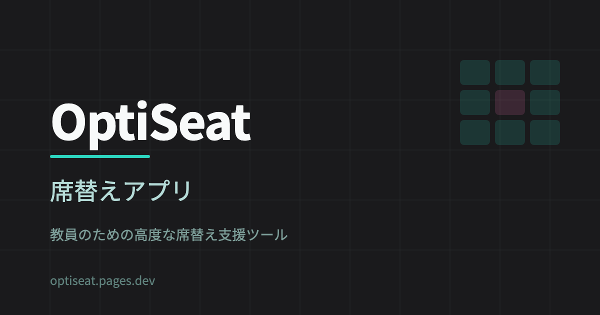
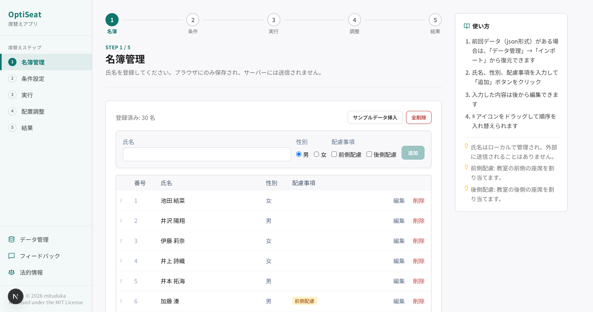
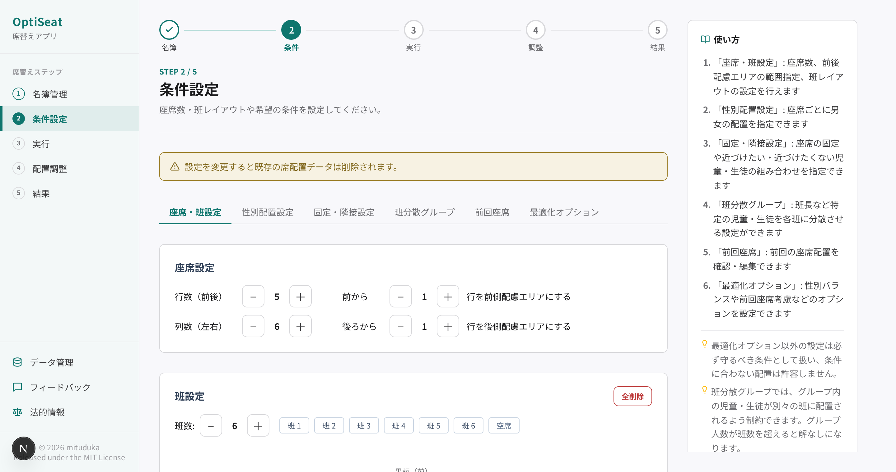
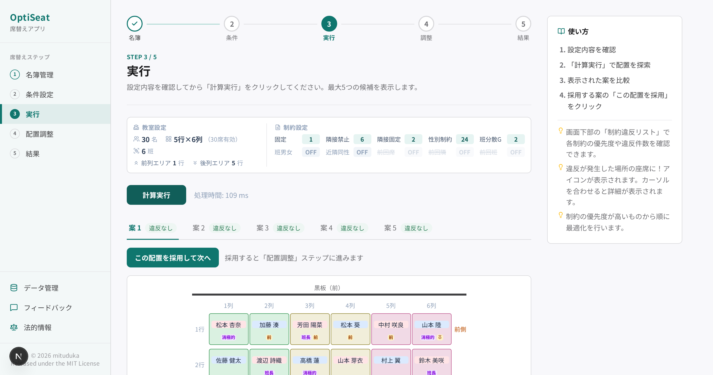
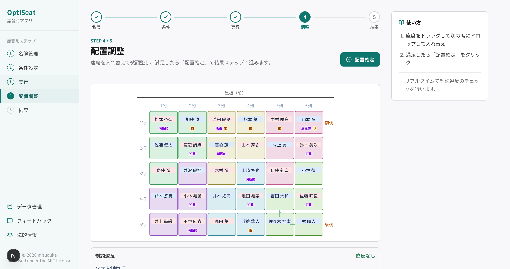
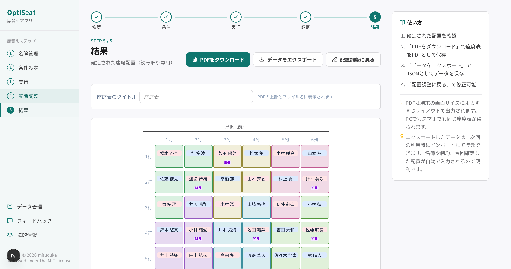
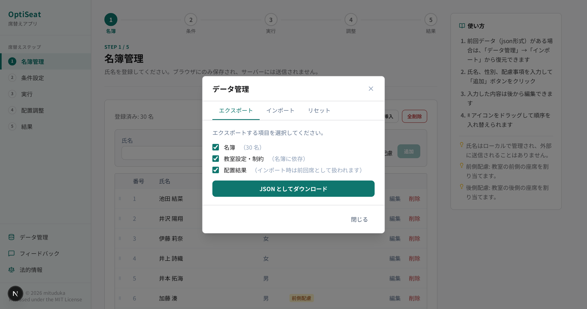

<div align="center">



**制約を宣言するだけで、教室の席替えを自動で最適化。**

ASP（Answer Set Programming）ソルバ [clingo](https://github.com/potassco/clingo) を使った、学校教員のための席替え支援 Web アプリ。

[](https://github.com/mituduka/OptiSeat/actions/workflows/ci.yml)
[](./LICENSE)


### 今すぐ試す → **[optiseat.pages.dev](https://optiseat.pages.dev)**

[特徴](#特徴) ・ [主な機能](#主な機能) ・ [クイックスタート](#クイックスタート) ・ [仕組み](#仕組み) ・ [ドキュメント](#ドキュメント)

</div>

## OptiSeat とは

学校での席替えは「視力に配慮して前列に」「この子たちは隣にしない」「班長は各班に分散」… と条件が多く、手作業では時間がかかり、配慮の偏りも生まれがちです。

OptiSeat は **条件をルールとして宣言するだけ** で、それらを同時に満たす席配置の案を複数提示します。教員は提示された複数案をもとに、手動での調整を直感的に行うことで配置を決定することができます。

## 特徴

### 🧩 柔軟な条件設定
前/後側の配慮、隣接させたい/させたくないペア、自由な班のレイアウト、空席指定、性別による配置、班分散グループなど、多彩な条件を自由に組み合わせて指定できます。  
教室だけでなく、バスの座席などへの応用も可能です。

### 🧭 迷わないステップ型 UI
名簿 → 条件 → 実行 → 調整 → 結果 の 5 ステップを、画面上部のステップナビで常に明示します。完了したステップにはチェックが付き、各画面の「次へ」ボタンで迷わず進められます。

### 🚨 違反箇所が直感的にわかる
条件に違反している箇所を簡単に把握でき、手動調整の際に条件の見落としを防止できます。

### 🔄 前回座席を考慮
前回の配置を読み込み、前回と同じ席・隣・班になりにくいよう考慮した席替えができます。

### 🎲 複数の案を提示
条件を満たす配置を一度に複数案生成。見比べて理想に最も近い案を選べます。

### 📱 PC・タブレット・スマホ対応
PC からの利用はもちろん、モバイル UI も提供しているため、教育現場でも導入されている Chromebook, iPad などの端末からの利用も可能です。座席グリッドは画面幅に合わせて自動縮小し、収まりきらない場合は横スクロールに切り替わるため、小さな画面でも座席表全体を確認できます。

> [!TIP]
> **すぐ触ってみたい方へ**  
> インストール・初期設定不要の WebAssembly 版を [optiseat.pages.dev](https://optiseat.pages.dev) で公開しています。  
> 本リポジトリはセルフホスト版です。

> [!IMPORTANT]
> **プライバシー設計**  
> 児童・生徒の氏名はブラウザの localStorage だけに保存します。氏名は API に送信されず、フロントエンドで内部 ID に変換して処理するため、個人情報がサーバーに渡ることはありません。  
> WebAssembly 版（[optiseat.pages.dev](https://optiseat.pages.dev)）では計算もブラウザ内で完結するため、氏名はもちろん、ID を含むデータも一切サーバーに送信されません。

## 主な機能

<h3 align="center">① 名簿　➜　② 条件　➜　③ 実行　➜　④ 調整　➜　⑤ 結果</h3>
<p align="center">画面上部の <b>ステップナビ</b> に沿って進めるだけで席替えが完成します</p>

<!-- TODO: ステップナビを含む新 UI 全体のスクリーンショットを追加する -->
<!--  -->

---

### 📋   名簿を登録 — 個人情報の外部送信は行いません

児童・生徒の氏名・性別・配慮事項を登録するだけ。氏名はブラウザ内（localStorage）にのみ保存され、サーバーには送られません。



### 🧩 条件を登録する

「視力配慮の子は前列に」「このペアは隣にしない」「班長は各班に分散」など、配慮したい条件を選んで登録するだけで、複雑なルールの組み合わせを OptiSeat が引き受けます。



### 🎲 複数の配置案を自動計算して提示

条件を満たす席配置を **複数案** 自動生成。スコア（条件への適合度）とともに並ぶので、**理想に最も近い案を教員自身が見比べて選べます**。



### ✋ 直感的に手動調整 — 違反もひと目で

気になる席はドラッグ＆ドロップ／タップ交換でその場で入れ替えできます。  
動かすたびに制約違反を **リアルタイムで再計算** し、どの条件にいくつ違反しているかを内訳で表示します。  
条件違反がないか把握しつつ、理想へ近づける最後のひと押しを直感的に行えます。



### 🖨 そのまま PDF で保存・印刷

完成した座席表は、すぐに PDF 形式で出力。配布・掲示にそのまま使えます。



### 📁 名簿・条件は再利用可能

名簿、条件、結果はファイルにエクスポート可能。次回の席替えで条件を再利用できるほか、前回座席を考慮した席替えができます。



## クイックスタート

Docker Compose を使用して、ホストに Node.js / Python / clingo をインストールせずに動作させることができます。

```bash
docker compose up -d   # 本番ビルドで起動（初回はビルドのため数分かかります）
```

| URL | 用途 |
|---|---|
| <http://localhost:3000> | フロントエンド（Next.js） |
| <http://localhost:8000> | バックエンド API（FastAPI） |
| <http://localhost:8000/docs> | Swagger UI |

停止

```bash
docker compose down
```

開発時は `docker-compose.dev.yml` を利用できます。

```bash
docker compose -f docker-compose.dev.yml up
```

## デプロイと環境変数

クイックスタートの `docker compose up -d` が本番構成なので、セルフホスティングにそのまま使えます。  
必要に応じてリバースプロキシ配下に置いてください。動作確認済み規模はクラス 40 人程度です。

> [!WARNING]
> API に認証・レート制限はありません（同時実行数の制限のみ）。インターネットへ直接公開せず、学内 LAN またはリバースプロキシでのアクセス制御を前提に運用してください。

### 環境変数

設定は用途ごとに 3 つのファイルに分かれています。いずれも**任意**で、未設定なら既定値が使われます。各 `.env.example` をコピーして作成してください。

| ファイル | 用途 | 読み込まれ方 |
|---|---|---|
| `.env`（リポジトリ直下） | ポート・公開ドメイン・CORS・API URL | docker compose が自動ロード |
| `backend/.env` | ソルバ調整値（人数上限・タイムアウトなど） | docker compose の `env_file`（ファイルが無くても起動可） |
| `frontend/.env.local` | フロント公開変数（公開 URL など） | Next.js が自動ロード |

#### `.env`（デプロイ設定）

ポートを変えるには `FRONTEND_PORT` / `BACKEND_PORT` を設定するだけで、CORS と API URL も既定で自動追従します。

| 変数名 | 説明 | デフォルト |
|---|---|---|
| `FRONTEND_PORT` | フロントエンドの公開ポート（ホスト側） | `3000` |
| `BACKEND_PORT` | バックエンドの公開ポート（ホスト側） | `8000` |
| `NEXT_PUBLIC_API_URL` | ブラウザからアクセスするバックエンド API の URL | `http://localhost:<BACKEND_PORT>` |
| `CORS_ORIGINS` | CORS 許可オリジン（カンマ区切り） | `http://localhost:<FRONTEND_PORT>` |

#### `backend/.env`（ソルバ設定）

既定値・用途は [`backend/api/config.py`](./backend/api/config.py) / [`backend/.env.example`](./backend/.env.example) に対応します。

| 変数名 | 説明 | デフォルト |
|---|---|---|
| `SEAT_MAX_ROWS` | グリッドの最大行数 | `12` |
| `SEAT_MAX_COLS` | グリッドの最大列数 | `12` |
| `MAX_STUDENTS` | 1クラスの最大児童・生徒数（バリデーション上限） | `50` |
| `SOLVER_TIMEOUT_DEFAULT` | ソルバのデフォルトタイムアウト秒数 | `30` |
| `SOLVER_TIMEOUT_MAX` | 指定可能なタイムアウトの上限秒数 | `120` |
| `SOLVER_MAX_SOLUTIONS_DEFAULT` | 取得する解候補数のデフォルト | `5` |
| `SOLVER_MAX_SOLUTIONS_MAX` | 取得できる解候補数の上限 | `10` |
| `SOLVER_RAND_FREQ` | clingo の `--rand-freq`（0〜1、探索のランダム性） | `1.0` |
| `SOLVER_WORKERS` | ソルバ並列実行のワーカー数 | CPU コア数 |

> [!NOTE]  
> ポートと CORS は `.env`（リポジトリ直下）で制御します。  
> `backend/.env` に `CORS_ORIGINS` を書いても compose の設定が優先されるため効きません。

#### `frontend/.env.local`（フロント公開変数）

| 変数名 | 説明 | デフォルト |
|---|---|---|
| `NEXT_PUBLIC_SITE_URL` | サイトの公開 URL（OGP 画像など絶対 URL が必要なメタデータの解決に使用） | `http://localhost:3000` |

## 仕組み

OptiSeat は席替えを **制約充足・最適化問題** として解きます。条件は大きく2種類に分類できます。

- **ハード制約（必ず守る）** — 座席固定 / 8方向の隣接禁止 / 同班禁止 / 座席ごとの性別指定 / 相対位置の固定 / 班分散グループ
- **ソフト制約（できるだけ満たす＝最適化）** — 前後配慮 / 班内の男女バランス / 孤独感の緩和 / 前回の席・班・隣との差分

ソルバがハード制約を満たす配置の中から、ソフト制約の違反が最小になる解を複数列挙します。  
ロジックは ASP プログラム（`backend/solver/lp/*.lp`）として宣言的に記述されています。詳細は [`docs/asp-design.md`](./docs/asp-design.md) を参照してください。

## 技術スタック

| レイヤー | 技術 |
|---|---|
| ソルバ | [clingo](https://github.com/potassco/clingo) 5.8+, [clorm](https://github.com/potassco/clorm) 1.6+ |
| バックエンド | FastAPI, uvicorn, pydantic v2 |
| フロントエンド | Next.js 16, React 19, TypeScript 6, Tailwind CSS 4 |
| 状態管理 | Zustand 5 |
| ドラッグ＆ドロップ | @dnd-kit/core 6 |
| テスト | pytest（バックエンド） / Vitest 4, @testing-library/react（フロントエンド） |

## プロジェクト構成

```
OptiSeat/
├── backend/
│   ├── solver/        # clingo ソルバ実行 + ASP プログラム (.lp)
│   ├── api/           # FastAPI ルーティング・スキーマ・スコア計算
│   └── tests/         # pytest
├── frontend/
│   ├── public/        # 静的アセット（フォント・アイコン等）
│   └── src/
│       ├── app/       # Next.js App Router の各ページ
│       ├── components/# UI コンポーネント
│       ├── lib/       # 状態管理・API クライアント
│       └── types/
├── docs/              # 各種設計ドキュメント
├── legal/             # 利用規約・プライバシーポリシー等の正本
├── LICENSE            # MIT License 正文
├── NOTICE.md          # 第三者ソフトウェア表示
├── SECURITY.md        # 脆弱性報告窓口
└── CONTRIBUTING.md    # コントリビューションガイド
```

## API 概要

| メソッド | パス | 概要 |
|---|---|---|
| `GET` | `/health` | サーバー・ソルバの稼働確認 |
| `GET` | `/api/v1/config` | アプリケーション設定取得 |
| `POST` | `/api/v1/solve` | 席替え計算の実行 |
| `POST` | `/api/v1/score` | 手動調整後の制約違反数再計算 |
| `POST` | `/api/v1/validate` | 制約設定の矛盾チェック |

詳細は [`docs/api-spec.md`](./docs/api-spec.md) を参照してください。

## テスト

```bash
# バックエンド（pytest）
docker exec optiseat-backend-1 bash -c "cd /workspace && pytest backend/tests/ -q"

# フロントエンド（Vitest）
docker exec optiseat-frontend-1 bash -c "cd /workspace/frontend && npm test -- --run"

# 型チェック（tsc --noEmit）
docker exec optiseat-frontend-1 bash -c "cd /workspace/frontend && npm run lint"
```

テスト構成・開発フローの詳細は [`CONTRIBUTING.md`](./CONTRIBUTING.md) を参照してください。

## ドキュメント

| 文書 | 内容 |
|---|---|
| [`docs/requirements.md`](./docs/requirements.md) | 要件定義書 |
| [`docs/architecture.md`](./docs/architecture.md) | システムアーキテクチャ |
| [`docs/asp-design.md`](./docs/asp-design.md) | ASP ロジック設計書 |
| [`docs/api-spec.md`](./docs/api-spec.md) | API 仕様書 |

## コントリビューション

- バグ報告・機能要望: [GitHub Issues](https://github.com/mituduka/OptiSeat/issues)
- 脆弱性報告: [`SECURITY.md`](./SECURITY.md)（GitHub Security Advisories でのプライベート報告）
- 開発参加: [`CONTRIBUTING.md`](./CONTRIBUTING.md)

Issue / PR を歓迎します。気に入ったら ⭐ で応援してください。

## ライセンス

OptiSeat は [MIT License](./LICENSE) のもとで配布されています。第三者ソフトウェアの一覧と各ライセンス種別は [`NOTICE.md`](./NOTICE.md) を参照してください。

各種規約は `legal/` 以下に正本を配置しており、アプリケーション上のサイドバー「法的情報」からも閲覧できます。

| 文書 | リポジトリ | アプリ内パス |
|---|---|---|
| 利用規約 | [`legal/terms.md`](./legal/terms.md) | `/legal/terms` |
| プライバシーポリシー | [`legal/privacy.md`](./legal/privacy.md) | `/legal/privacy` |
| ライセンス情報（要約） | [`legal/license.md`](./legal/license.md) | `/legal/license` |
| 第三者ソフトウェア表示 | [`NOTICE.md`](./NOTICE.md) | `/legal/notice` |
