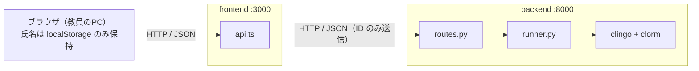
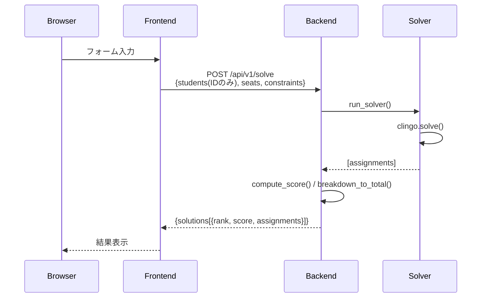
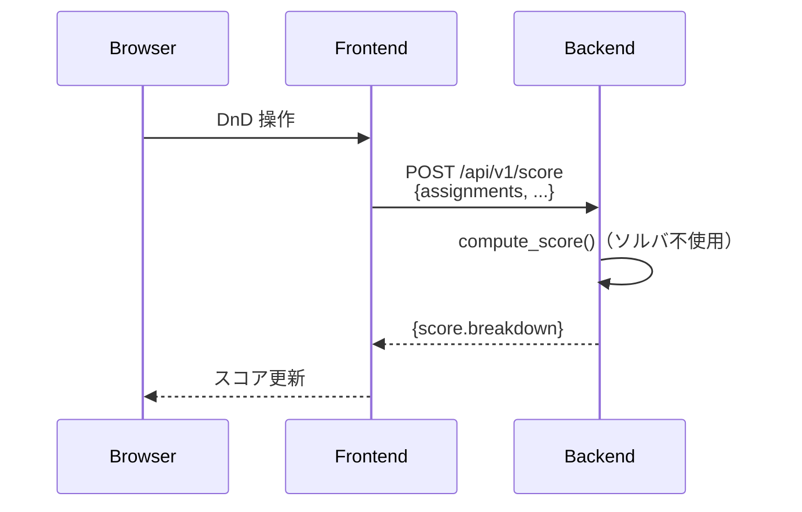

# システムアーキテクチャ設計書

**プロジェクト名**: OptiSeat  
**バージョン**: 1.0.0  
**最終更新**: 2026-06-17

## 目次

1. [全体構成図](#1-全体構成図)
2. [コンポーネント詳細](#2-コンポーネント詳細)
3. [データフロー](#3-データフロー)
4. [ディレクトリ構成](#4-ディレクトリ構成)
5. [テスト構成](#5-テスト構成)
6. [開発環境構成](#6-開発環境構成)

## 1. 全体構成図

FastAPI バックエンドが clingo を実行する自己ホスト構成。  
ブラウザは計算を API に委譲し、氏名は送らず内部 ID のみを送信する。  
ASP ロジック（`base.lp` / `hard.lp` / `soft.lp`）・スコア計算・バリデーションは backend の `solver/`（Python）に実装される。
制約体系（Hard / Soft）の詳細仕様とスコア計算は [`asp-design.md`](./asp-design.md)・[`requirements.md`](./requirements.md) を参照。



## 2. コンポーネント詳細

### 2.1 Frontend（Next.js）

| 項目 | 詳細 |
|------|------|
| フレームワーク | Next.js 16.2.7 (App Router) |
| スタイリング | Tailwind CSS 4（CSS-first 設定・`globals.css` の `@theme`） |
| 状態管理 | Zustand 5（localStorage 永続化、store version=1） |
| ドラッグ＆ドロップ | @dnd-kit/core v6.3.1（PointerSensor + TouchSensor） |
| HTTP通信 | fetch API（`src/lib/api.ts`） |
| テスト | Vitest 4 + @testing-library/react |

**主要ページ（5ステップ構成）**

5 つのページはそのまま席替えの 5 ステップに対応し、各ページ上部のステップ表示（`StepNav`）で現在地と完了状態を明示する。次ステップへの導線は各ページ内に置く（`NextStepBar`、解の採用、配置確定）。

| ステップ | ページ | パス | 役割 | 完了条件（StepNav 判定） |
|---|--------|------|------|------|
| 1 | 名簿管理 | `/students` | 児童・生徒の追加・編集・削除 | 名簿 1 名以上 |
| 2 | 条件設定 | `/settings` | グリッドサイズ・班・各種制約の設定 | 案の採用（ステップ3と共通） |
| 3 | 実行 | `/solve` | 計算リクエストと解候補一覧・採用 | 案の採用 |
| 4 | 配置調整 | `/finalize` | ドラッグ＆ドロップで手動微調整。調整後スコア再計算 | 配置確定 |
| 5 | 結果 | `/display` | 座席表の最終表示・PDF 出力 | 配置確定 |

**デザインシステム**

UI デザインは[デジタル庁デザインシステム](https://design.digital.go.jp/)を参考にしたライトテーマ。8px グリッドの余白リズム・タイポグラフィ階層・コントラスト要件（テキスト 4.5:1 / 非テキスト 3:1）の考え方を踏襲している（準拠を保証するものではない）。トークンは `globals.css` の `@theme` に定義する。

- 参考: [デジタル庁デザインシステム](https://design.digital.go.jp/) / [デザインデータ・基本要素の解説](https://design.digital.go.jp/foundations/)

- プライマリ: 青竹ティール `#0F766E`（`--color-primary`、白文字 5.5:1）。strong / deep / soft / pale の5段階
- ニュートラル: テキスト `--color-ink` 系、境界 `--color-line` 系、背景 `--color-canvas`（#F8F8FB のグレーキャンバス + 白カード）
- サイドバー: プライマリの淡色ティント（面 5% `--color-sidebar` / 選択 13% `--color-sidebar-active`）
- セマンティックカラー: DADS の色相（赤=エラー / 黄=警告 / 緑=サクセス）を維持しつつ彩度を抑えた `--color-error` / `--color-warning` / `--color-success`（各 無印=境界・アイコン用 3:1、strong=テキスト用 4.5:1、soft=背景）
- 班色: 黄金角で色相分散（`groupColors.ts`）。境界 3:1・文字 4.5:1 を満たすまで色相ごとに明度を自動調整
- コンポーネントクラス: `.card`（面）、`.btn` + `.btn-primary` / `.btn-secondary` / `.btn-quiet` / `.btn-danger`（ボタン）
- タイポグラフィ: Noto Sans JP（400 / 700 の 2 ウェイト）、本文 14px 以上・基本行間 160%、8px グリッドの余白リズム
- コンテンツ幅: `main` 内は最大 1280px で中央寄せ（`.main-safe-padding`）

**アクセシビリティ実装**

- フォーカス: `:focus-visible` でプライマリ色 2px アウトラインをサイト全体に統一（DADS 標準の黒+黄からの意図的逸脱。一貫性・3:1 以上は確保）
- ツールチップ: ホバーに加えフォーカスで表示・Escape で消去（WCAG 1.4.13）。説明文は `aria-label` / `sr-only` でも提供
- キーボード操作: DnD は KeyboardSensor（Enter/Space + 矢印キー）、グリッドセルは `role="button"` + Enter/Space
- 通知: 動的エラーは `role="alert"`、警告は `role="status"`
- モーダル: フォーカストラップ・初期フォーカス・呼び出し元への復帰・`aria-labelledby`（`Modal.tsx`）
- 意図的逸脱（14px 未満を許容する箇所）: 座席セル内のラベル、ナビの短縮ラベル、件数/ON・OFF チップ — 密度・領域制約のため。読み上げ情報は別途確保している

### 2.2 Backend（FastAPI）

| 項目 | 詳細 |
|------|------|
| フレームワーク | FastAPI |
| 実行サーバー | uvicorn |
| バリデーション | Pydantic v2 |
| テスト | pytest |

**主要モジュール**

| モジュール | 役割 |
|-----------|------|
| `main.py` | FastAPIアプリ本体・CORS設定 |
| `config.py` | 環境変数による設定値管理（`MAX_STUDENTS`・タイムアウト上限・グリッドサイズ上限等） |
| `routes.py` | 全エンドポイント実装・ソルバ内部エラー時の `SOLVER_ERROR` レスポンス処理 |
| `schemas.py` | Pydantic v2 入出力スキーマ（`SolveRequest` / `ScoreRequest` / `ValidateRequest` など） |
| `score.py` | `compute_score()` によるスコア計算（ソルバ不使用） |
| `validation.py` | 制約整合性チェック（固定・禁止・性別・相対固定の矛盾検出） |
| `runner.py` | マルチシードループでclingoを実行・重複排除して解を返す |
| `facts.py` | JSON → clorm `FactBase` 変換 |
| `predicates.py` | clorm `Predicate` クラス定義（`Assign`, `Student`, `Seat` など） |

### 2.3 Solver（clingo + clorm）

| 項目 | 詳細 |
|------|------|
| ソルバ | clingo 5.8+（pip install） |
| ORM | clorm 1.6+ |
| ASPファイル | `base.lp`（生成）/ `hard.lp`（必須制約）/ `soft.lp`（@5〜@1 辞書式最適化） |

**マルチショット × マルチシード × 距離制約方式**

```python
ctrl = Control(["-n", "1", "--opt-mode=optN", "--heuristic=Domain",
                f"--rand-freq={SOLVER_RAND_FREQ}", f"--seed={first_seed}",
                f"--parallel-mode={max_workers}"])
# .lp ロード + FactBase 投入 + ground()（base の grounding はここで1回のみ）
for shot in range(max_solutions):
    # ショットごとに全スレッドのシードを変更
    for i in range(len(ctrl.configuration.solver)):
        ctrl.configuration.solver[i].seed = str(random.randint(0, 2**31 - 1))
    # solve（per_shot_timeout = max(1, timeout / max_solutions) で打ち切り）
    # 最良解を frozenset キーで重複排除して収集
    # 解が得られたら距離制約を追加 grounding:
    #   divsolK(S, R) ファクト + 「一致座席数 <= N - min_diff」の integrity constraint
    #   → 以降のショットは既出解から min_diff 人以上が動いた配置だけを探索
```

単一の `Control` で base の grounding を1回だけ行い（multi-shot solving）、ショットごとに異なるランダムシードで探索する。解が得られるたびに距離制約（`SOLVER_MIN_DIFF_RATIO`、既定 0.5 = 生徒の半数以上が移動）を小さな program part として追加 grounding し、候補どうしが大きく異なる配置になることを保証する。十分に異なる解が尽きた場合（距離制約下の UNSAT）は件数を水増しせず打ち切る。詳細は [`asp-design.md` §4](./asp-design.md) を参照。

## 3. データフロー

### 3.1 席替え実行フロー



### 3.2 手動調整→スコア再計算フロー



## 4. ディレクトリ構成

```
OptiSeat/
├── docker-compose.yml
├── docs/
│   ├── requirements.md
│   ├── architecture.md
│   ├── asp-design.md
│   └── api-spec.md
│
├── backend/
│   ├── solver/
│   │   ├── __init__.py
│   │   ├── predicates.py       # clorm Predicateクラス（Assign, Student, Seat 等）
│   │   ├── facts.py            # JSON → FactBase 変換ヘルパー
│   │   ├── runner.py           # マルチシードループ実行・重複排除
│   │   └── lp/
│   │       ├── base.lp         # Generate（1人1席の割り当て生成）
│   │       ├── hard.lp         # Hard制約（fixed / forbidden / seat_gender /
│   │       │                   #   relative_fixed / leader_group）
│   │       └── soft.lp         # Soft制約（@5〜@1 辞書式最適化の弱制約）
│   │
│   ├── api/
│   │   ├── __init__.py
│   │   ├── main.py             # FastAPIアプリ・CORS設定
│   │   ├── config.py           # 環境変数による設定値管理
│   │   ├── routes.py           # 全エンドポイント・ソルバエラー時の SOLVER_ERROR 処理
│   │   ├── schemas.py          # Pydantic v2 スキーマ
│   │   ├── score.py            # compute_score() によるスコア計算
│   │   └── validation.py       # 制約整合性チェック
│   │
│   └── tests/
│       ├── __init__.py
│       ├── test_solver.py      # ソルバ単体テスト（Hard/Soft制約・班分散グループの動作検証）
│       ├── test_api.py         # API統合テスト（solve/validate/soft_toggles/prev_options/ソルバエラー）
│       ├── test_score_and_meta.py  # スコア計算・制約メタデータテスト（ソルバ不使用）
│       ├── test_score.py       # compute_score() テスト（ハード違反・欠損seat_id耐性・最適化オプション）
│       ├── test_validation.py  # バリデーションロジック単体テスト
│       └── fixtures/
│           └── sample_class.json   # テスト用サンプルデータ（6名・2×3グリッド・2班）
│
└── frontend/
    ├── package.json
    └── src/
        ├── app/
        │   ├── layout.tsx          # ルートレイアウト（Sidebar + AppInit）
        │   ├── page.tsx            # トップページ（/students へリダイレクト）
        │   ├── students/page.tsx   # 名簿管理
        │   ├── settings/page.tsx   # 条件設定（グリッドUI・各種制約）
        │   ├── solve/page.tsx      # 席替え実行・結果一覧
        │   ├── finalize/page.tsx   # 配置調整（@dnd-kit DnD）
        │   ├── display/page.tsx    # 結果表示・PDF出力
        │   └── legal/              # 法的情報ページ（terms / privacy / license / notice）
        ├── components/
        │   ├── Sidebar.tsx         # ナビゲーションサイドバー（白基調・ステップ番号付き）
        │   ├── MobileHeader.tsx    # モバイル用ヘッダー
        │   ├── BottomNav.tsx       # モバイル用下部ナビゲーション
        │   ├── StepNav.tsx         # 5ステップの進行表示（完了状態は store から導出）
        │   ├── PageHeader.tsx      # ステップページ共通ヘッダー（StepNav + 見出し + 操作）
        │   ├── NextStepBar.tsx     # ページ末尾の「次のステップへ」導線
        │   ├── Modal.tsx           # 汎用モーダル
        │   ├── NumberStepper.tsx   # 数値増減 UI
        │   ├── AppInit.tsx         # 初回 /api/v1/config フェッチ・設定エラーをストアに保存
        │   ├── ConflictAlerts.tsx  # 制約矛盾アラート表示
        │   ├── GridScrollArea.tsx  # 座席グリッド共通スクロール領域（自動縮小 + 横スクロールヒント）
        │   ├── SeatGrid.tsx        # 教室グリッド表示・制約設定UI
        │   ├── SeatingGrid.tsx     # 結果表示用座席グリッド（DnD・違反バッジ）
        │   ├── DraggableSeat.tsx   # @dnd-kit 用座席ドラッグセル
        │   ├── SolutionTabs.tsx    # 解候補タブ切り替え
        │   ├── StudentTable.tsx    # 児童・生徒一覧テーブル
        │   ├── ScoreBreakdownTable.tsx  # 違反内訳テーブル
        │   ├── SeatingResult.tsx   # 席替え結果カード（スコア・内訳・違反表示）
        │   ├── DataManagementModal.tsx  # JSONエクスポート/インポートモーダル
        │   ├── HelpPanel.tsx       # 使い方サイドパネル（xl 以上は sticky、未満はスライドイン）
        │   └── LegalPage.tsx       # 法的情報ページの共通レイアウト（legal/*.md を表示）
        ├── hooks/
        │   ├── useSolve.ts         # 席替え計算カスタムフック
        │   ├── useGridScale.ts     # 座席グリッド自動スケール（モバイルは下限 0.62 でクランプ）
        │   └── useHasHydrated.ts   # localStorage からの復元完了を判定（永続化データの描画ズレ防止）
        ├── lib/
        │   ├── store.ts            # Zustand（localStorage永続化・version=1）
        │   ├── api.ts              # APIクライアント（fetch）
        │   ├── constraints.ts      # 制約矛盾検出ユーティリティ
        │   ├── constraintLabels.ts # 制約ラベル定数（ローカル管理）
        │   ├── navItems.ts         # 5ステップのナビゲーション定義（Sidebar/BottomNav/StepNav 共通）
        │   ├── groupColors.ts      # 班色管理
        │   ├── sampleData.ts       # サンプル名簿データ
        │   ├── legal.ts            # 法的文書（legal/*.md・NOTICE.md）の読み込み
        │   ├── seats.ts            # 座席IDと(row,col)の変換ユーティリティ
        │   └── pdf/                # 座席表PDF生成（クライアントサイド・ベクター描画）
        ├── types/
        │   └── index.ts            # 共通型定義
        └── test/
            ├── setup.tsx
            └── useGridScale.test.ts        # 座席グリッドスケールテスト
            #（その他のテストは各コンポーネント・lib・hooks 隣接配置）
```

## 5. テスト構成

### バックエンドテスト（pytest）

| ファイル | 対象 | ソルバ使用 |
|---------|------|-----------|
| `test_solver.py` | clingoソルバの Hard/Soft制約動作・班分散グループ | ✓ |
| `test_api.py` | REST APIエンドポイント統合テスト・ソルバエラー処理 | 一部 ✓ |
| `test_score_and_meta.py` | `compute_score()` の各違反カウント・班分散グループ | ✗（高速） |
| `test_score.py` | `compute_score()` テスト（ハード違反・欠損seat_id耐性・孤独感最適化・班分散グループ） | ✗（高速） |
| `test_validation.py` | バリデーションロジック単体テスト（班分散グループ含む） | ✗（高速） |

### フロントエンドテスト（Vitest）

| ファイル | 対象 |
|---------|------|
| `lib/store.test.ts` | Zustandストアの全アクション・leaderGroups・removeForbidden双方向削除 |
| `lib/seats.test.ts` | 座席変換ユーティリティ・スコア集計 |
| `lib/constraints.test.ts` | 制約矛盾検出ロジック |
| `test/useGridScale.test.ts` | 座席グリッド自動スケール hook |
| `components/StudentTable.test.tsx` | 名簿テーブルコンポーネント |
| `components/SeatingGrid.test.tsx` | 座席グリッド（DnD含む） |
| `app/display/page.test.tsx` | 表示ページ |
| `components/SeatGrid.test.tsx` | 座席グリッドコンポーネント |
| `hooks/useSolve.test.ts` | 席替え計算 hook |
| `lib/api.test.ts` | APIクライアント関数 |
| `components/ConflictAlerts.test.tsx` | 制約矛盾アラート |
| `components/NumberStepper.test.tsx` | 数値増減 UI |
| `lib/pdf/seatingModel.test.ts` | 座席表PDF用データモデル変換 |
| `components/DataManagementModal.test.tsx` | データ管理モーダル |
| `lib/pdf/seatingPdf.test.ts` | 座席表PDF生成 |
| `lib/pdf/hslToRgb.test.ts` | PDF用 HSL→RGB 変換 |
| `lib/pdf/fitSingleLine.test.ts` | PDF上で氏名を1行に収める処理 |
| `lib/pdf/layout.test.ts` | 座席表PDFレイアウト計算 |
| `lib/pdf/loadFont.test.ts` | PDF用フォント読み込み |
| `components/SolutionTabs.test.tsx` | 解候補タブコンポーネント |
| `components/ScoreBreakdownTable.test.tsx` | スコア内訳テーブル |
| `app/students/page.test.tsx` | 名簿管理ページ |
| `components/Modal.test.tsx` | 汎用モーダル |
| `app/solve/page.test.ts` | 席替え実行ページ |
| `components/MobileHeader.test.tsx` | モバイルヘッダー |
| `components/SeatingResult.test.tsx` | 席替え結果コンポーネント |

## 6. 開発環境構成

### docker compose サービス構成

| サービス | ベースイメージ | 役割 |
|---------|--------------|------|
| `backend` | `python:3.12-slim-bookworm` | FastAPI + clingo + clorm |
| `frontend` | `python:3.12-slim-bookworm`（Node 22 を後付けインストール） | Next.js（本番 compose は `next build` + `next start`、`docker-compose.dev.yml` は dev server） |

> [!NOTE]
> 両サービスは同一の `.devcontainer/Dockerfile` を共有しており、python ベースイメージに NodeSource 経由で Node.js を後付けインストールしている。

### 主要コマンド

```bash
# 起動
docker compose up -d

# 停止
docker compose down

# ログ確認
docker compose logs -f backend
docker compose logs -f frontend

# バックエンドテスト
docker exec optiseat-backend-1 bash -c "cd /workspace && pytest backend/tests/ -v"

# フロントエンドテスト
docker exec optiseat-frontend-1 bash -c "cd /workspace/frontend && npm test -- --run"

# バックエンドに入る
docker exec -it optiseat-backend-1 bash

# フロントエンドに入る（npm コマンドはコンテナ内のみ）
docker exec -it optiseat-frontend-1 bash
```

### ポート構成

| ポート | サービス |
|--------|---------|
| 3000 | Next.js フロントエンド |
| 8000 | FastAPI バックエンド |
